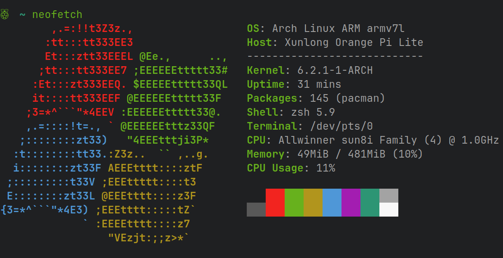

# OrangePi-Lite-UBoot

本仓库提供了适用于 Orange Pi Lite 的 boot-script / u-boot 的源码和已编译的镜像文件。

其中 u-boot 提供了三个不同版本的镜像文件。

| Stable           | RC           | Git       |
|:-----------------|:-------------|:----------|
| [下载 Stable 版] | [下载 RC 版] | @fa6f458c |

[下载 Stable 版]: binary/u-boot/Stable
[下载 RC 版]: binary/u-boot/RC

## 使用

### Boot Srcipt

0. 将对应的内存卡通过读卡器插入电脑设备
1. 挂载: `mount /dev/sdX /mnt`
2. 复制: `cp boot.scr /mnt/boot/`

### U-Boot

+ 写入: `sudo dd if=u-boot-sunxi-with-spl.bin of=/dev/sdX bs=1024 seek=8`

## F.A.Q

### 如何定制/编译 boot-srcipt？

1. 进入 boot-srcipt 目录
    + `cd source/boot-script/`
2. 根据自己的需求修改 boot.cmd 代码
    + `vim boot.cmd`
3. 生成镜像
    + `mkimage -A arm -O linux -T script -C none -a 0 -e 0 -n "OrangePi-Lite Boot Script" -d boot.cmd boot.scr`

**注：**

使用 `mkimage` 命令需系统已安装 [uboot-tools] 软件包。

[uboot-tools]: https://archlinux.org/packages/community/x86_64/uboot-tools/

### 如何定制/编译 u-boot 镜像？

1. 进入 u-boot 目录
    + `cd source/u-boot/`
2. 根据自己的需求修改代码
2. 编译
    + `make -j16 ARCH=arm CROSS_COMPILE=arm-none-eabi- orangepi_lite_defconfig`
    + `make -j16 ARCH=arm CROSS_COMPILE=arm-none-eabi-`

**注：**

编译需系统已安装 [arm-none-eabi-gcc]、[dtc]、[swig] 软件包。

[arm-none-eabi-gcc]: https://archlinux.org/packages/community/x86_64/arm-none-eabi-gcc/
[dtc]: https://archlinux.org/packages/community-staging/x86_64/dtc/
[swig]: https://archlinux.org/packages/staging/x86_64/swig/
